# Agenda Nusantara

Agenda Nusantara adalah aplikasi mobile sederhana berbasis Flutter dan SQLite untuk membantu pengguna mencatat dan mengelola daftar tugas harian.

## Fitur Utama

- Login pengguna
- Tambah tugas penting dan tugas biasa
- Menandai tugas selesai/belum selesai
- Statistik tugas selesai dan belum selesai
- Grafik penyelesaian tugas
- Penyimpanan lokal menggunakan SQLite
- Ganti password pengguna

## Teknologi

- Flutter
- Dart
- SQLite (sqflite)

## Screenshot Aplikasi

### Login Page
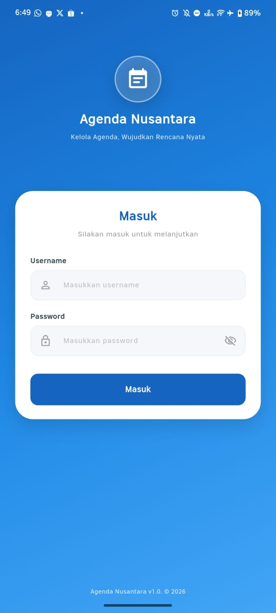

### Homepage
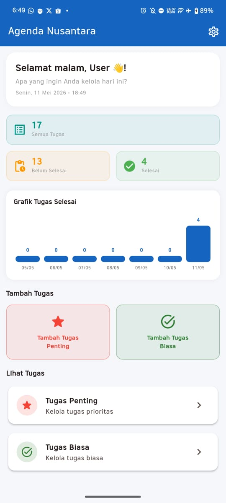

### All Tasks
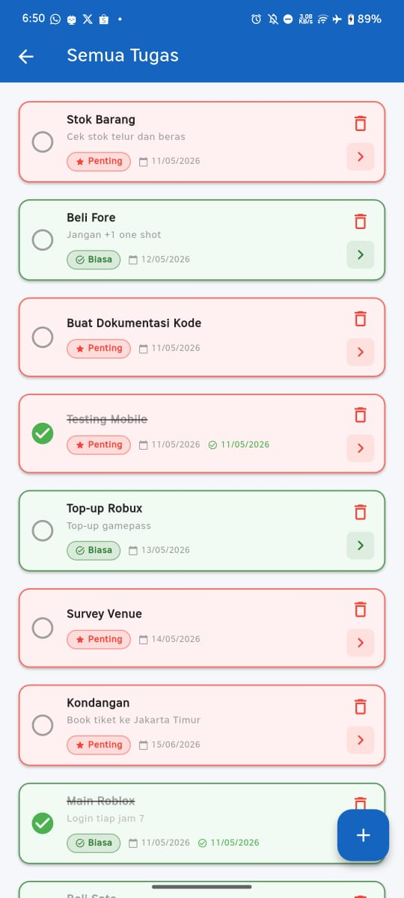

### Task Done
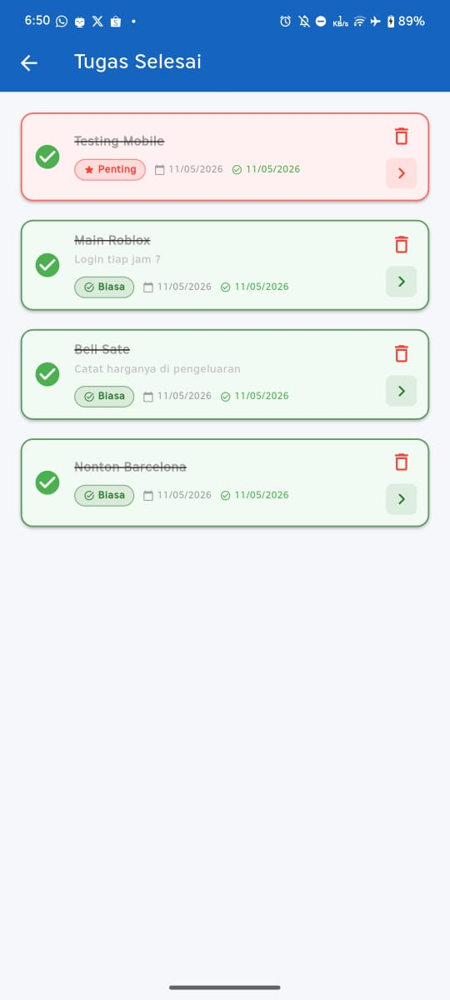

### Task Undone
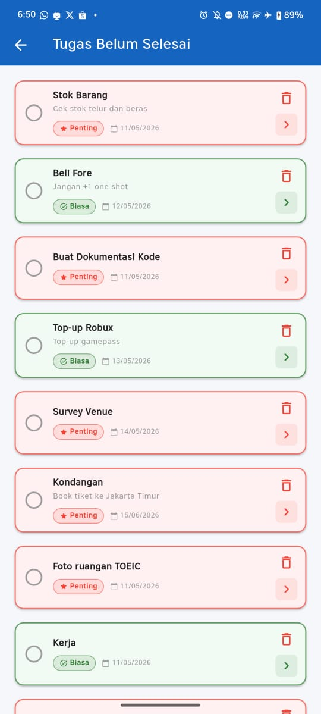

### Tambah Tugas Penting
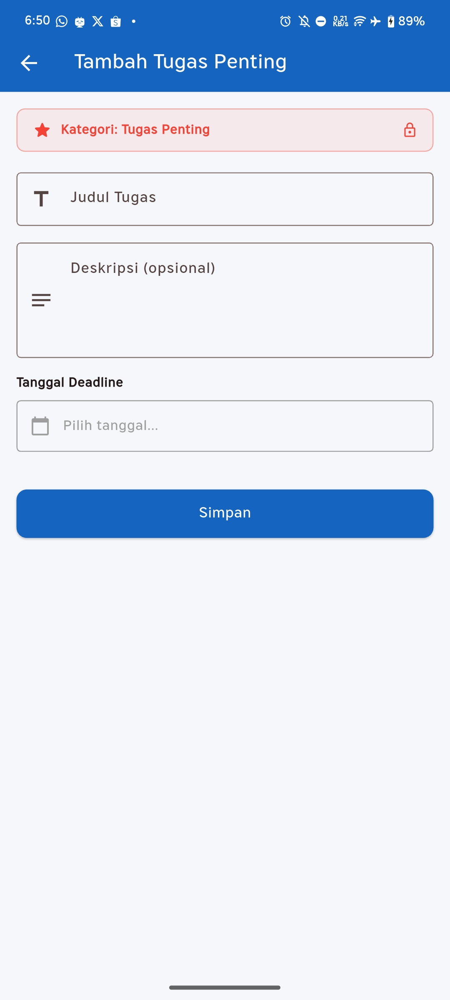

### Tambah Tugas Biasa
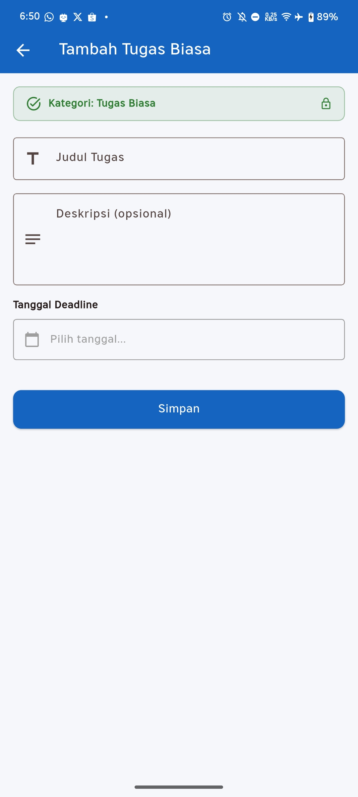

### Regular Task List
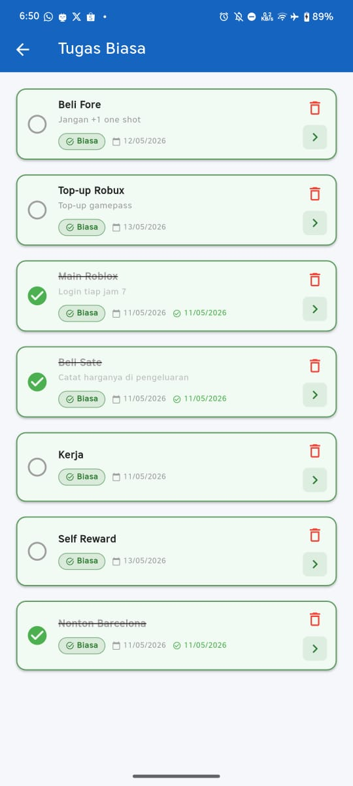

### Important Task List
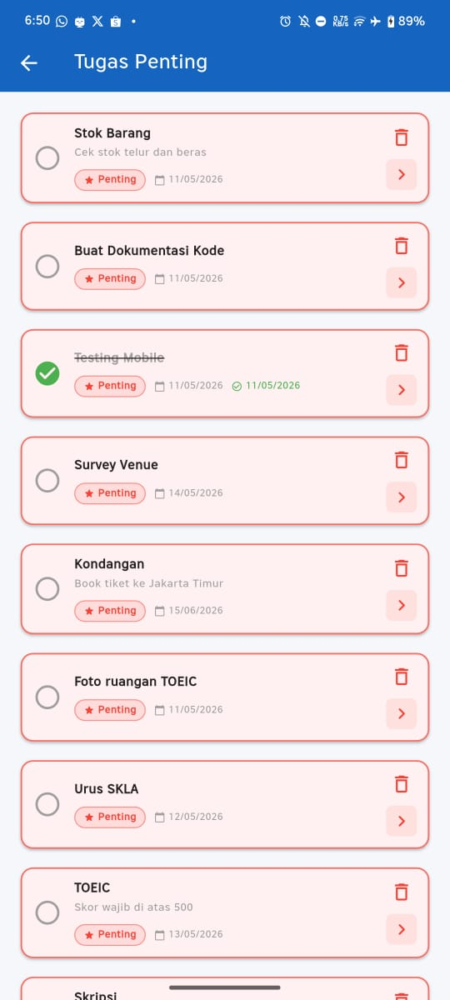

### Pengaturan
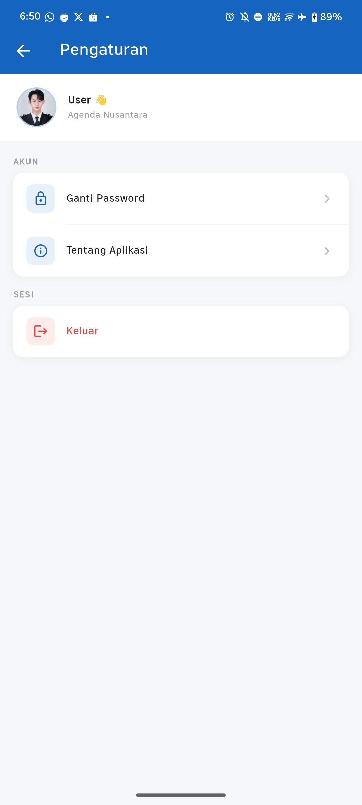

### Ganti Password
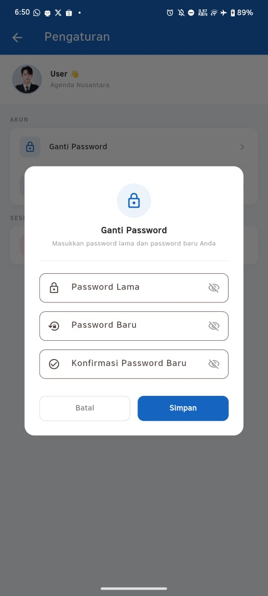

### Tentang Aplikasi
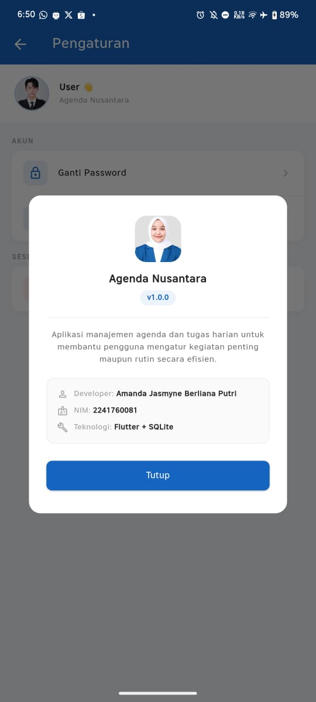

## Cara Menjalankan Project

```bash
flutter pub get
flutter run
```

## Developer

Nama: Amanda Jasmyne Berliana Putri  
NIM: 2241760081  

